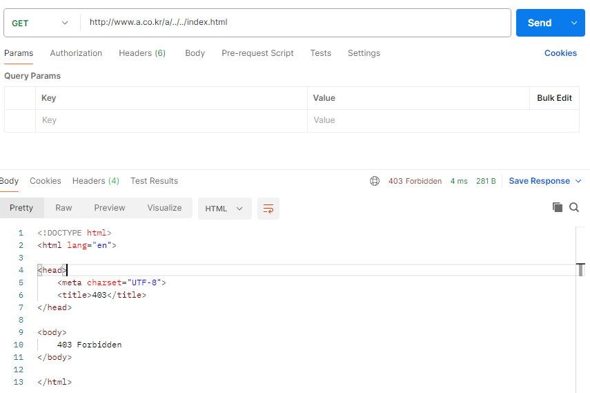
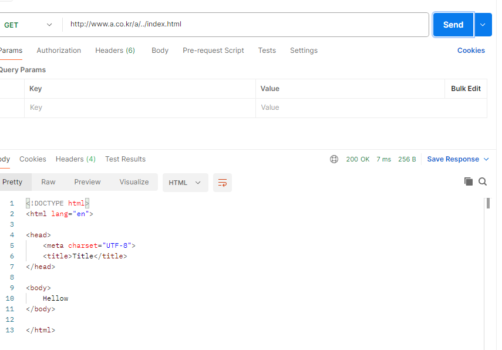

## 스펙
1. HTTP/1.1의 Host 헤더를 해석하세요. [1번 테스트 이동](#1번-테스트)
   - [vhost.json](./src/main/resources/vhost.json)을 통해 포트번호, 호스트, documentRoot, index페이지, 에러페이지 지정이 가능합니다 
   - "serverNm" 수정을 통해 동일 IP이더라도 다른 리소스를 제공할 수 있습니다.
2. 다음 사항을 설정 파일로 관리하세요. [1번 테스트 이동](#1번-테스트)
   - [vhost.json](./src/main/resources/vhost.json)을 통해 포트번호, 호스트, documentRoot, index페이지, 에러페이지 지정이 가능합니다
   - 현재 문서상 80포트에서 동작하고 있습니다. 포트번호 수정시 해당 포트번호로 이용 가능합니다.
3. 403, 404, 500 오류를 처리합니다. [3번 테스트 이동](#3번-테스트)
   
4. 다음과 같은 보안 규칙을 둡니다. [4번 테스트 이동](#4번-테스트)
   - 상위 디렉터리 접근할 때 
5. logback 프레임워크 http://logback.qos.ch/를 이용하여 다음의 로깅 작업을 합니다.
   - 일자별로 로그생성 [로그](./logs)
   - 오류 발생시 StackTrace 전체 로그 남김 [StackTrace로그](./logs/was.log)
   - debug시 로그 남기지 않지만 info 이상의 경우 로그 남김
6. 간단한 WAS를 구현합니다. [6번 테스트 이동](#6번-테스트)
   - class명을  통한 매핑 가능
   - 전략 패턴을 통한 확장성 고려
7. 현재 시각을 출력하는 SimpleServlet 구현체를 작성하세요. [7번 테스트 이동](#7번-테스트)
   - WAS와 APP이 분리 완료
   - WAS(SimpleServlet 인터페이스) APP(SimpleServlet 구현체) 분리 완료 
8. 앞에서 구현한 여러 스펙을 검증하는 테스트 케이스를 JUnit4를 이용해서 작성하세요 
   - 주요 클래스 TDD작성 되었습니다. [Test위치](./src/test/java)
   - mvn clean package시 Junit 실행되도록 플러그인이 설치된 상태입니다. 


## TEST방법
#### 1번 테스트
   1. http://www.b.co.kr/service.TimeView  ==> resources/web2 디렉토리를 바라봄
   2. http://www.a.co.kr/service.TimeView  ==> resources/web 디렉토리를 바라봄

#### 3번 테스트
   1. 403 : http://www.a.co.kr/a/test.exe
   2. 404 : http://www.a.co.kr/a/notfound
   3. 500 : http://www.a.co.kr/service.a.ErrorTestClass

#### 4번 테스트
   1. http://www.a.co.kr/a/../../index.html : 오류발생 
   2. http://www.a.co.kr/a/../index.html == http://www.a.co.kr/index.html : 정상 

#### 6번 테스트
   1. http://www.a.co.kr/service.TimeView ==> service.TimeView.java 매핑
   2. 전략 디자인 패턴을 이용해서 차후 설정 파일을 통한 매핑이 필요할 경우 전략 교체를 통해 개발 가능합니다. 
[PackageMappingStrategy.java](./src/main/java/org/mapping/strategy/PackageMappingStrategy)
```
public class PackageMappingStrategy implements ServletMappingStrategy{

    @Override
    public SimpleServlet getServlet(String path) {
        return ServletFactory.search(path.replaceAll("/", ""));
    }
}
```

#### 7번 테스트
- WAS와 APP 프로젝트는 분리되어있습니다. 해당 프로젝트는 WAS입니다. 아래 가이드를 통해 프로젝트 실행 가능합니다.[프로젝트 실행 가이드](#프로젝트-실행-가이드)

## 프로젝트 실행 가이드
#### 실행 방법
1. WAS프로젝트에서 mvn clean install 실행 (APP프로젝트에 pom.xml에서 사용)
2. APP프로젝트에서 SimpleApplicationContext.java에서 실행

#### 서블릿 등록 방법
1. 서블릿 클래스 위치는 SimpleApplicationContext 이하에 존재해야됩니다.
2. 서블릿 클래스에 SimpleServlet인터페이스를 implements
3. src/main/resources/META-INF/services/org.servlet.SimpleServlet 파일에 클래스 등록

